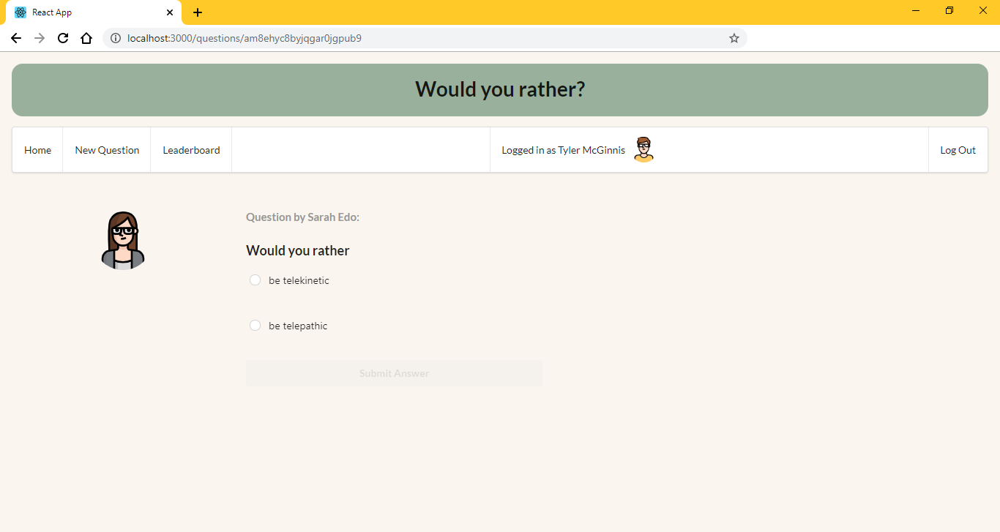
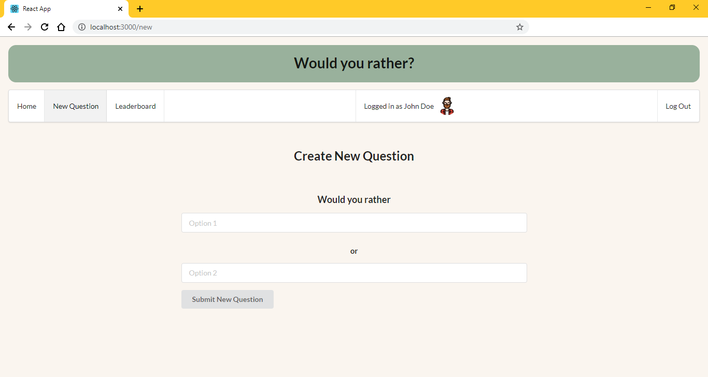

# Would You Rather Project

This is the final assessment project for Udacity's React & Redux course, the 'Would you rather?' app, where the user can answer a question by choosing one of two options.

## To get started

* clone project with `https://github.com/susumoa/would-you-rather.git`
* install all project dependencies with `npm install`
* start the development server with `npm start`

## How to use

### Login

Choose from one of the existing users, then log in.

### Home

Unanswered questions are automaticly shown as teasers. To see the full question, click on Show question.
To see the answered question, change to the Answered tab.
The navigation bar shows who is the logged in user, and lets the user log out.

### Unanswered Question

The author's avatar and name are shown with the two options. After choosing the submit button becomes enabled.

### Answered Question

The author's avatar and name are shown with the two options. The chosen answer is marked. Both answers have their statistics (what percent of the users chose this answer, how many users chose this answer). The submit button is disabled. The user can't change the chosen answer.

### New Question

Ask a new question by filling the two input fields with the two options. The user can't sumbit the question if one of the options is empty.

### Leaderboard

The leaderboard shows who asked and answered the most questions.

## Pictures

Pictures are from [https://www.flaticon.com/packs/avatar-10](https://www.flaticon.com/packs/avatar-10)